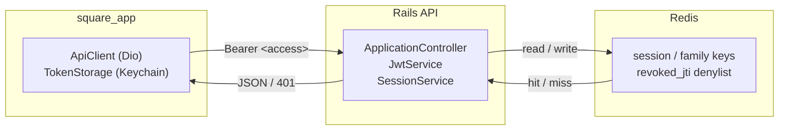
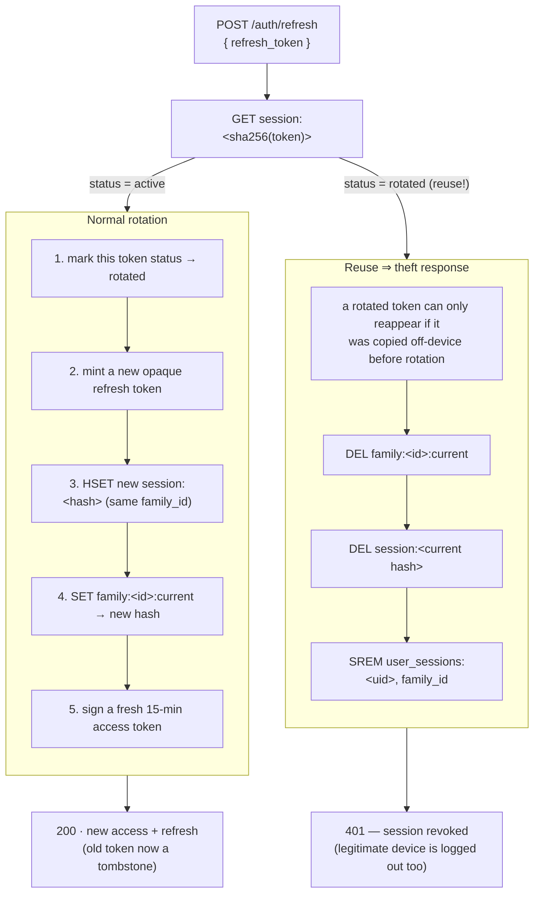
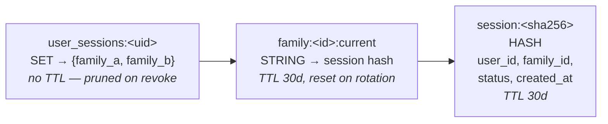
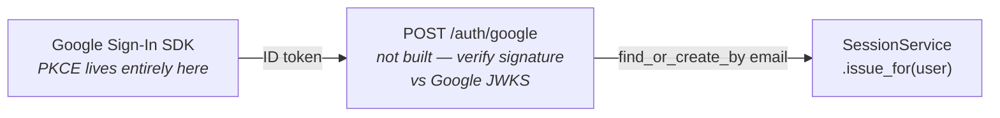

# Authentication

How Square's session system works: short-lived access tokens, a Redis-backed
refresh token that rotates on every use, and a theft response that kills a
session the instant a used token is replayed.

- Access token — 15 min JWT (`ACCESS_TOKEN_TTL_MINUTES`)
- Refresh token — 30 day opaque token in Redis (`REFRESH_TOKEN_TTL_DAYS`), 90
  day absolute cap (`REFRESH_ABSOLUTE_TTL_DAYS`)
- Rotation + reuse detection on every refresh
- No MFA, no PKCE, no billing/plan model yet — see [Not built yet](#not-built-yet)

## Overview

Three components share the work. The Flutter app never talks to Redis, and
Redis never talks to the client — Rails is the only party that reads or
writes a session record.



## The two credentials

Every login hands back a pair, not a token. They have opposite jobs and
opposite lifespans.

**Access — a signed JWT, 15 minutes.** Sent as `Authorization: Bearer` on
every request. Rails verifies its signature and never touches Redis to trust
it, except for a one-line denylist check. Stateless on purpose: cheap to
verify, useless to an attacker within minutes of expiry.

**Refresh — an opaque random string, 30 days.** Only ever sent to
`/auth/refresh` or `/auth/logout`. Rails looks it up in Redis by its SHA-256
hash — nothing about it is trusted without a lookup. Stateful on purpose:
it's the only thing that can be revoked before it expires.

## 01 · Login & signup

Password auth is unchanged — `has_secure_password`, bcrypt. What's new is
what happens after the password checks out: a session **family** (one
lineage of rotating tokens) is opened in Redis before anything is returned
to the client.

```mermaid
sequenceDiagram
    participant C as Client
    participant R as Rails
    participant D as Redis

    C->>R: POST /auth/login {email, password}
    Note over R: User.authenticate_login — bcrypt compare
    Note over R: SessionService.issue_for(user)
    R->>D: HSET session:&lt;hash&gt;
    R->>D: SET family:&lt;id&gt;:current
    R->>D: SADD user_sessions:&lt;uid&gt;
    Note over D: all three writes share one TTL — REFRESH_TOKEN_TTL_DAYS (30)
    R-->>C: 200 · access_token + refresh_token
    Note over C: both saved to Keychain / Keystore
```

## 02 · Authenticated requests, and the silent refresh

Every other endpoint just checks the access token's signature and expiry —
no Redis round trip for the common case. Redis only gets consulted for the
denylist, and when a 401 forces a refresh.

```mermaid
sequenceDiagram
    participant A as ApiClient interceptor
    participant R as Rails

    A->>R: GET /dashboard · Bearer &lt;expired&gt;
    R-->>A: 401 — signature expired

    rect rgba(150,105,42,0.08)
    Note over A: single-flight lock — a second concurrent 401 just awaits<br/>this same Future instead of calling /auth/refresh again
    A->>R: POST /auth/refresh {refresh_token}
    R-->>A: 200 · new access + refresh
    end

    Note over A: both saved · original request headers rewritten
    A->>R: GET /dashboard · Bearer &lt;new&gt;  (retried once)
    R-->>A: 200 — caller never sees the 401
```

If the refresh call itself 401s, `TokenStorage` is cleared and
`authProvider.forceSignOut()` runs — the router already redirects to `/auth`
whenever `authProvider` goes to `null`.

Implemented in `square_app/lib/core/network/api_client.dart`.

## 03 · Refresh & rotation — and what a stolen token buys you

Both paths below start from the same call. They fork on one question: **has
this exact refresh token been redeemed before?**



An absolute 90-day cap (`REFRESH_ABSOLUTE_TTL_DAYS`) forces re-login even
along the happy path.

**Why this matters:** a stolen refresh token is worth exactly one silent
use. The moment the legitimate device also tries to refresh — which it
eventually will — one of the two copies gets rejected as a reuse and the
whole family dies, logging out attacker and victim alike. Compare that to a
static long-lived token, which is worth full account access for as long as
no one notices.

Implemented in `SessionService#refresh`,
`rails_backend/app/services/session_service.rb`.

## 04 · Logout & logout everywhere

Logging out is a normal, non-adversarial version of the revoke path above —
plus one extra step, because the access token used to make the request is
still cryptographically valid for whatever's left of its 15 minutes.

```mermaid
sequenceDiagram
    participant C as Client
    participant R as Rails
    participant D as Redis

    Note over C,R: POST /auth/logout — this device only
    C->>R: Bearer &lt;access&gt; · {refresh_token}
    R->>D: DEL family:*, session:*<br/>SREM user_sessions:&lt;uid&gt;
    R->>D: SET revoked_jti:&lt;jti&gt; (ex: seconds left on this token)
    R-->>C: 204 No Content
```

```mermaid
sequenceDiagram
    participant C as Client
    participant R as Rails
    participant D as Redis

    Note over C,R: POST /auth/logout-all — every device
    C->>R: Bearer &lt;access&gt;
    R->>D: SMEMBERS user_sessions:&lt;uid&gt;
    D-->>R: [family_a, family_b, family_c, …]
    R->>D: revoke_family() for each id
    R->>D: DEL user_sessions:&lt;uid&gt;<br/>SET revoked_jti:&lt;jti&gt; for this device
    R-->>C: 204 No Content
```

Logout-all reads every family id for the user out of `user_sessions` and
revokes each one — every phone, tablet, and browser session dies within one
request. Plain logout only touches the caller's own family; other logged-in
devices are untouched.

## Redis key schema

No Postgres table backs any of this — a session is ephemeral, TTL'd data by
nature, so it lives entirely in Redis. Everything is looked up by a token's
**hash**, never by the token itself; nothing readable is stored.



| Key | Type | TTL | Written by |
|---|---|---|---|
| `session:<sha256>` | hash | 30d, sliding | Every login and every rotation |
| `family:<id>:current` | string | 30d, sliding | Points at whichever session hash is currently valid for this lineage |
| `user_sessions:<uid>` | set | none | One entry per active login (device); powers "log out everywhere" |
| `revoked_jti:<jti>` | string | ≤ 15m | Logout only — makes the current access token unusable immediately instead of waiting out its expiry |

`revoked_jti` is unrelated to the family tree above — it's keyed by the
*access* token's `jti`, not by anything in the refresh-token lineage.

## The Flutter client

Before this system, every one of the app's ten repositories built its own
`Dio` instance and copy-pasted `Options(headers: {'Authorization': ...})`.
Both problems — where the token lives, and who attaches it — are fixed in
one place now.

- **Storage:** `TokenStorage` (`square_app/lib/core/network/token_storage.dart`)
  wraps `flutter_secure_storage` — Keychain on iOS, Keystore on Android.
  Tokens never touch `SharedPreferences`, which is plaintext on disk.
- **Attachment:** one `apiClientProvider` Dio instance
  (`square_app/lib/core/network/api_client.dart`), shared by every
  repository. Its request interceptor attaches the current access token;
  nothing else does.

## Config & endpoints

| Setting | Default | Meaning |
|---|---|---|
| `ACCESS_TOKEN_TTL_MINUTES` | 15 | JWT lifetime — the denylist only ever needs to hold an entry this long |
| `REFRESH_TOKEN_TTL_DAYS` | 30 | Idle timeout — resets on every successful rotation |
| `REFRESH_ABSOLUTE_TTL_DAYS` | 90 | Hard ceiling on a family's age, even if it's used daily |

| Endpoint | Auth | Body |
|---|---|---|
| `POST /auth/signup` | — | email, password, first_name, last_name |
| `POST /auth/login` | — | email, password |
| `POST /auth/refresh` | — | refresh_token |
| `POST /auth/logout` | Bearer | refresh_token |
| `POST /auth/logout-all` | Bearer | — |
| `GET /auth/me` | Bearer | — |

## Not built yet

**PKCE** is deliberately absent. PKCE protects the authorization code in a
browser-redirect OAuth flow — there's no redirect and no code in a direct
password POST, so there's nothing for it to protect.

Where PKCE *does* apply — a future "Sign in with Google" — the exchange
happens entirely inside Google's own SDK before Rails is ever involved:



The seam is `SessionService.issue_for(user)`: any future login method just
needs to resolve a `User` and hand it here — same rotation, same theft
response, same Redis keys as password login, zero changes to the sections
above.

**Also deferred:**
- **MFA** — dead `otp` / `otp_expiry` columns exist on `users` from an
  earlier attempt, but no working flow.
- **Billing / plan gating** — no `Plan` or `Subscription` model exists;
  "MFA on paid plans" needs one built first.
